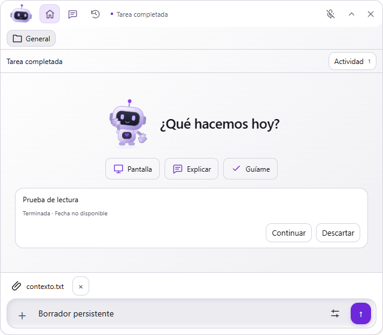

# Cápsula de cabeza — Guion 04

Implementado el 07/10/2026 sobre el trabajo local de los guiones anteriores. La validación inicial conservó `Desktop/ZEN.exe`; la petición posterior de compilar y recompilar autoriza la entrega descrita al final.

## Resultado y medidas

La cápsula principal mide **490 × 46 DIP**, horizontal en el borde superior y en ambos laterales. Electron observó dos monitores con área útil de 1920 × 1032 DIP y escala **1 (100 %)**; su captura de la ventana mide 490 × 46 píxeles. Coincide por tanto con los aproximadamente 490 × 46 del recuadro rojo de la referencia en este entorno. Relación 10,65:1 frente a aproximadamente 10,6:1. No se infiere el DPI original de la captura del usuario.

Zona del personaje de 56 × 40 DIP, SVG de 56 × 36, cabeza/antena visibles de aproximadamente 30 DIP de alto; iconos de 17 DIP, botones de 30–34 × 32. Mínimo de uso: **320 DIP de ancho**; a ese ancho se reduce la zona del personaje a 52, los botones de navegación a 32 y el texto del estado se sustituye por un símbolo con nombre accesible. No hay segunda fila ni scroll en la cápsula.

Inicio, Chat y Tareas están siempre visibles. La cabeza abre Chat y permite arrastrar con el umbral existente de 4 DIP. Los otros botones no inician arrastre. Voz conserva su controlador real. El estado abre Actividad o el permiso pendiente; Detener aparece durante tareas o voz activa. Cerrar sigue ocultando ZEN, sin salir del proceso. Codex externo muestra **Pendiente de enviar**, sin inferir ejecución.

Se reutiliza la ventana existente: cabecera única de la misma altura y contenido ampliable debajo, proyecto dentro del panel. Al abrir cerca de un borde, el panel se ajusta al área útil; al plegar vuelve a la posición compacta guardada. La región nativa de entrada sigue el contorno redondeado y no reserva la altura antigua. Las listas, editor y conversación permanecen montados, ocultos al plegar, para conservar borradores, adjuntos, filtros y lectura. Los menús temporales del editor se cierran al plegar.

## Recursos y comportamiento

`Companion.tsx` conserva el SVG original completo. La variante `head` omite torso, piernas, brazos, teclado y sombra: no es un recorte de un muñeco encogido. Reutiliza cabeza, antena, visor y ojos; las manos son vectores independientes dentro de la misma zona fija y no reciben eventos de puntero. El personaje completo sigue disponible en Inicio y en el modo mascota opcional previo. Ese modo opcional conserva sus controles; el acceso principal de la cápsula ya no depende del abanico.

- Hover sostenido de 650 ms: saludo de una mano, máximo una vez cada 20 s.
- Permiso real nuevo: mano abierta durante 1,6 s; el permiso sigue accesible después.
- Arrastre sobre la cabeza con tipo de archivo aceptable y capacidad disponible: dos manos, retiradas al salir o soltar. La validación completa del archivo sigue haciéndose en el lector local al soltar; el gesto no concede acceso ni envía nada.
- Finalización observada de una tarea: aprobación breve, deduplicada por la autoridad de eventos existente. No al restaurar historial ni en un traspaso externo a Codex.
- Micrófono y expresiones usan el estado real. Movimiento reducido elimina la gesticulación animada; modo silencioso omite gestos decorativos. Los gestos no enfocan ventanas ni llaman al modelo.

Archivos principales: `src/shared/island.ts`, `src/main/overlay.ts`, `src/main/index.ts`, `src/renderer/App.tsx`, `CapsuleHead.tsx`, `Companion.tsx`, `Composer.tsx`, `head-capsule.css`, `src/shared/activity.ts` y `src/shared/companion.ts`.

## Evidencia

- `npm run build`: compilación de producción.
- `npm test -- --reporter=dot`: 325 pruebas, 38 archivos.
- `node scripts/head-capsule-ui.mjs`: reposo, saludo/cooldown, permiso y foco, manos de recepción, finalización única, clic/arrastre, controles, navegación sin peticiones, persistencia de borrador/adjuntos/lectura al plegar, tres bordes, mínimo de 320 y movimiento reducido. Cero llamadas a API/voz en fixtures.
- `node scripts/compact-ui.mjs`: regresión de proyectos, tareas, favoritos, contexto, accesibilidad y cinco tamaños; `interactions-ui.mjs` y `pet-ui.mjs`: recorridos previos.
- `node scripts/interactions-native.mjs`: Electron real y perfil aislado sin clave, con API bloqueada. Ventana 490 × 46, cabecera/navegación única, recuperación de posición; 12 combinaciones reales de geometría entre dos monitores, tres bordes y extremos, con panel/cápsula dentro del área útil. Entrada mediante eventos DOM simulados.
- Rasterización del renderer en 1 / 1,25 / 1,5 / 2; **no equivale a cambiar el DPI de Windows**.

Informes: `docs/evidence/head-capsule-ui.json`, `head-capsule-native.json` y `head-capsule-validation.json`. Capturas en `docs/ui-preview/head-capsule/`: `native-rest.png`, `native-panel.png`, `rest.png`, `wave.png`, `permission.png`, `receive.png`, `success.png`, `narrow.png` y `scale-*.png`.

## Límites y prueba manual

Pendientes: clic/arrastre físicos entre monitores, comprobar paso de clic por las esquinas transparentes sobre otra aplicación, voz física, foco con otras aplicaciones, desconexión física de un monitor y Windows a 125/150/200 %. Las pruebas de geometría/IPC y las capturas no acreditan esos casos. No se ha probado la API real ni cambiado proveedores, modelos, permisos, autenticación o JSON Live. No se declara completado el objetivo global de ZEN.

Para probar: ejecutar `Desktop/ZEN.exe`. Si estaba activado el modo mascota opcional, desactivar «Mostrar mascota al plegar» en Preferencias para usar la cápsula. Pasar el cursor por la cabeza, abrir Inicio/Chat/Tareas, escribir un borrador con un adjunto y plegar/desplegar; arrastrar la cabeza hacia los bordes. Abrir Actividad mediante el estado. Probar voz solo mediante su botón explícito.

## Entrega posterior autorizada

El primer intento de sustituir el ejecutable quedó bloqueado por la instancia anterior abierta; el archivo del escritorio seguía siendo la entrega antigua. Tras cerrarse esa instancia, la sustitución se realizó y se verificó su SHA-256 contra el EXE probado. El respaldo queda dentro de `release/desktop-backups`, sin carpetas ni accesos nuevos en la raíz del escritorio. La entrega incluye los guiones 03 y 04 y los cambios locales anteriores.

El arranque del portable extraído y las pruebas de IPC/geometría se comprueban sin API. Informes vigentes: `docs/evidence/single-executable.json`, `single-executable-deployment.json` y `portable-head-capsule.json`. La configuración Live y el agente guardado conservan sus hashes. Esta entrega no acredita los casos físicos pendientes descritos arriba.

## Seguimiento de cabeza reforzado

Petición posterior del 07/10/2026: recuperar un movimiento más visible al seguir el ratón. La cápsula y su cabecera desplegada reciben ahora el cursor de todo el escritorio; el límite de proximidad de 240 DIP se conserva solo en la mascota flotante opcional. El límite anterior también en la cápsula hacía que dejase de mirar al alejar el ratón.

La cabeza dispone de un grupo SVG independiente: desplazamiento máximo de 8 × 4 unidades SVG e inclinación de hasta 10 grados, con transición de 130 ms. Los ojos aumentan su recorrido horizontal de 6 a 9 unidades SVG, manteniéndose dentro del visor. No cambia el tamaño de la ventana ni la posición de controles; las manos y estados conservan sus gestos. El seguimiento mantiene el máximo de 20 Hz, envía solo cambios locales y se desactiva al ocultar o reducir movimiento, sin API ni capturas.

Validación: 325 pruebas unitarias y recorrido `scripts/head-capsule-ui.mjs` correctos, incluyendo posiciones a ±1200/1800 px, límites de la cabeza, geometría fija y detención en movimiento reducido. En el renderer a 490 × 46, la cabeza recorre aproximadamente 5,5 px y los ojos 12 px entre izquierda y derecha. Evidencia en `docs/evidence/head-capsule-ui.json`, capturas `gaze-left.png` y `gaze-right.png`. Son entradas simuladas; el seguimiento físico queda para comprobación del usuario.
