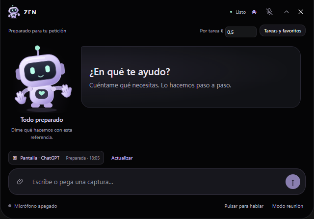
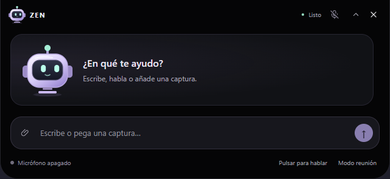

# Robot ZEN y mirada local · 02/10/2026

## Ampliación vigente: cuerpo, manos y gestos

La petición posterior «hazlo más grande» sustituye las medidas compactas iniciales: cápsula superior **320×72 DIP**, laterales **72×320**, chat de 640 DIP. Robot original con cuerpo, manos articuladas, visor y corazón; 64×68 en cápsula y 128×144 junto al mensaje desplegado. En pantallas estrechas se adapta a 76×86; dentro de paneles con poco alto se reduce sin cubrir controles. Solo se mantiene el último mensaje de Tú/ZEN.

`robotPresentation` traduce metadatos locales de ejecución a gestos: atender, pensar, leer con lupa, escribir con teclado, trabajar, hablar, esperar aprobación, terminar, revisar un fallo o descansar en pausa. Las confirmaciones tienen prioridad, un fallo nunca se presenta como éxito y las pausas conservan una pose quieta. El texto del modelo no elige gestos ni concede permisos. Pulsar «Saludar a ZEN» produce un saludo local de 1,6 segundos, sin ocultar aprobaciones, fallos o pausas.

El compañero permanece junto al mensaje, fuera de su scroll. La altura se calcula al asentar contenido y los deltas de streaming conservan DOM y tamaño de ventana. Animaciones por transform/opacity, sin GIF ni solicitudes nuevas. Movimiento reducido, preferencias y ocultación detienen gestos y mirada. Se preservan el agente remoto y los JSON de configuración, byte a byte.

Validación de esta ampliación: build, 294 pruebas, navegador Edge (gestos, saludo sin API, dos manos, bordes, chat estrecho, movimiento reducido y stream estable) y Electron nativo (320×72 y 72×320, controles, captura, barra de tareas y contratos existentes). Evidencia: `evidence/robot-interaction-ui.json`, `evidence/robot-interaction-electron.json`. No se hacen llamadas API nuevas ni se acreditan pendientes físicos de voz/Power Platform.

## Primera iteración y referencia

Actualizada la referencia `.reference/coucou` desde `3cc3333` hasta `5332f9ee4de9caaf4110c0fc4937e838c8c71ac4`, mediante fetch y avance rápido. Se revisaron las imágenes de `docs/media/` y fotogramas de `demo.gif`: cápsula negra, superficies interiores suaves, personaje reconocible y controles discretos. El robot de ZEN, los iconos y los sonidos son propios; no se incorporan el personaje Mochi ni archivos multimedia de Coucou.

## Presentación

- Robot vectorial lila, visor oscuro y ojos verdes separados del visor. Nuevo saludo con personaje de 88×88 px (72×72 en ventanas estrechas), texto legible y superficie redondeada.
- Robot de 36×36 px en cápsula, antes 26×26. Se mantienen las dimensiones exteriores de 240×40 DIP arriba y 40×240 en los laterales. Espacios y botones ajustados para conservar legibles «Abriendo web», «Abriendo Codex» y los controles durante una ejecución.
- Tarjetas suaves para el último mensaje de Tú/ZEN, compositor alineado y estados observados existentes. Sin historial visible ni redimensionamiento por delta de texto.
- Iconos originales regenerados para el EXE, ventanas y bandeja en nueve tamaños. Fuentes en `public/icons/robot.svg` y el componente `Companion.tsx`.

## Mirada fuera de la ventana

Main consulta `screen.getCursorScreenPoint()` como máximo 20 veces por segundo y convierte las coordenadas a la ventana de ZEN, incluyendo zoom y monitores de coordenadas negativas. Solo transmite cambios por un evento IPC al renderer local; el desplazamiento acotado se aplica al grupo de ojos, manteniendo inmóviles visor y cuerpo.

La lectura se detiene al ocultar/minimizar, al cerrar, al desactivar animaciones o al activar movimiento reducido. Al recuperar la cápsula se consulta una posición nueva. El acceso usa el mismo control de frame local del resto de IPC. No hay capturas de pantalla adicionales, almacenamiento de posiciones, escucha de teclado/botones, envío al modelo ni llamadas API. Esta animación no consume tokens y no amplía la autoridad de control del equipo.

## Verificación

- Build TypeScript/Vite y 287 pruebas en 33 archivos, incluyendo geometría, límites, pausa, reanudación y supresión de eventos repetidos.
- Edge con eventos de puntero sintéticos: ojos móviles y visor fijo; movimiento reducido y reactivación; cápsula superior y ambos laterales; estados y controles sin recortes; saludo y chat estrecho. Streaming: 80 deltas agrupados en 7 pinturas y cero cambios de altura o cabecera. [Informe](evidence/robot-ui.json).
- Windows/Electron y paquete de aplicación: lectura real del cursor de Windows, movimientos oculares mediante posiciones IPC sintéticas fuera de ZEN, pausa del lector en segundo plano y movimiento reducido. Conservadas las pruebas de bordes, barra de tareas, lectores, confirmaciones y Codex del escritorio. [Informe](evidence/robot-electron.json).
- No se hicieron llamadas nuevas a la API. `saved-agent.json` y `live-session.json` conservan sus hashes previos. La mirada no prueba inyección física de ratón/teclado; continúan los pendientes de [control visual](computer-control.md).

La entrega del EXE y sus hashes se registran en [distribución](single-executable.md) y `evidence/single-executable-deployment.json`. Paquetes y respaldos permanecen dentro de `release/`.
